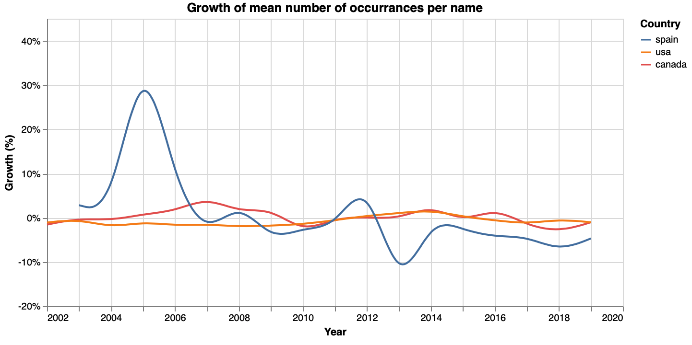
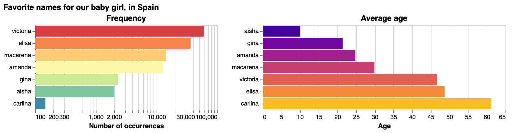
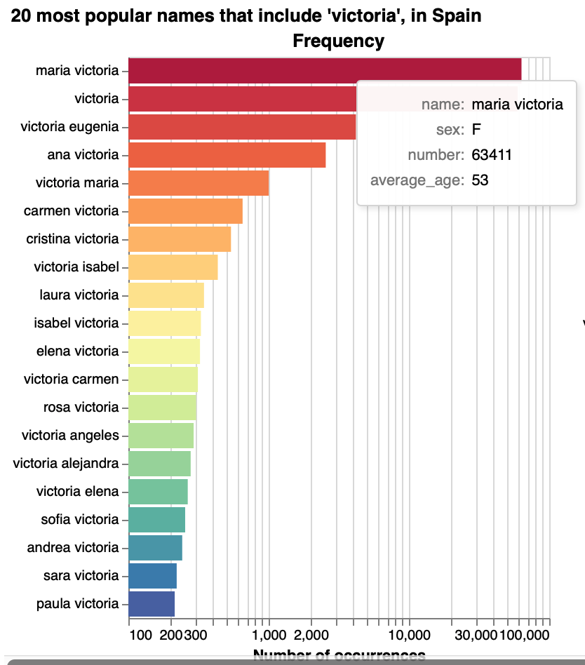
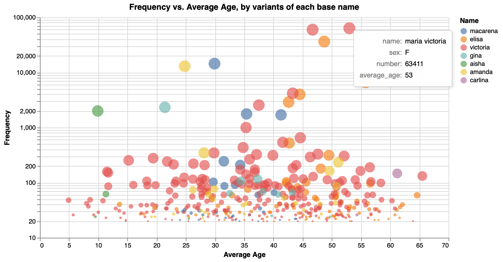
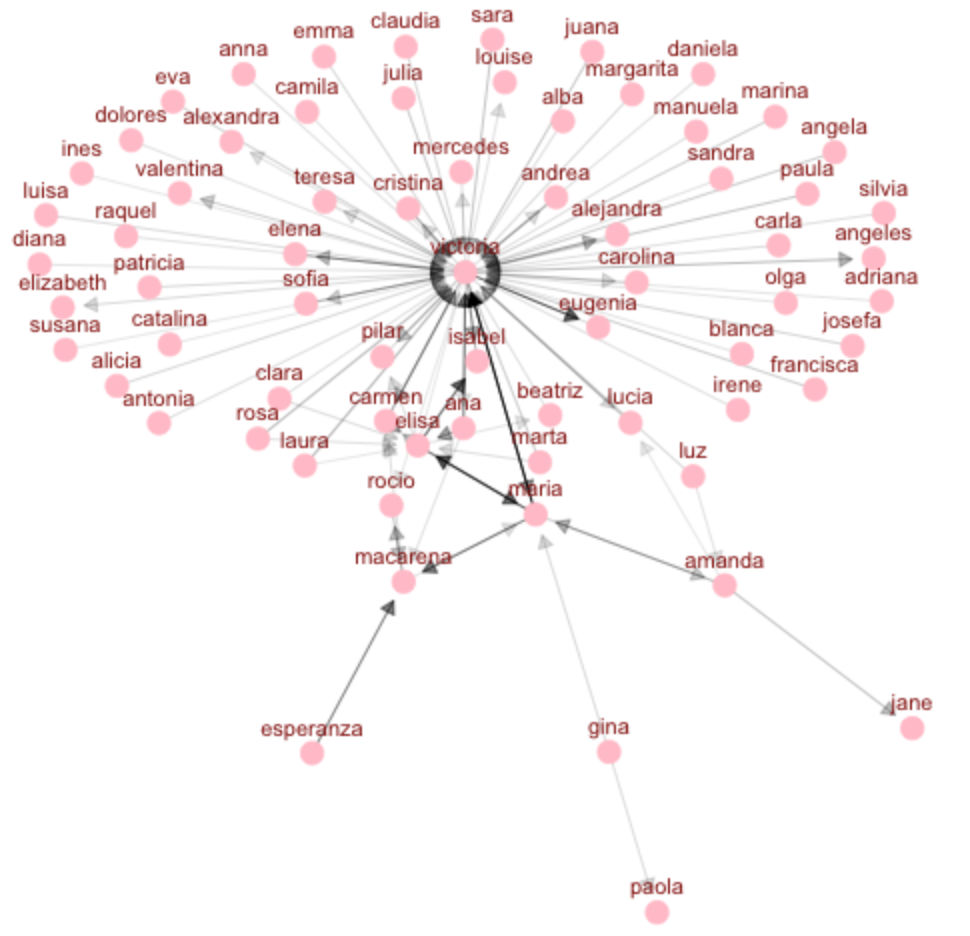
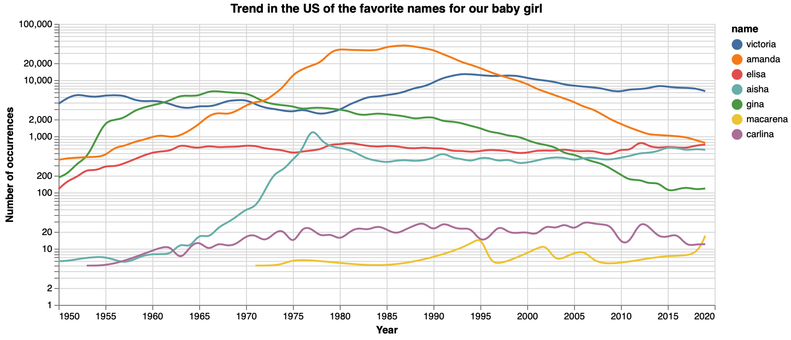
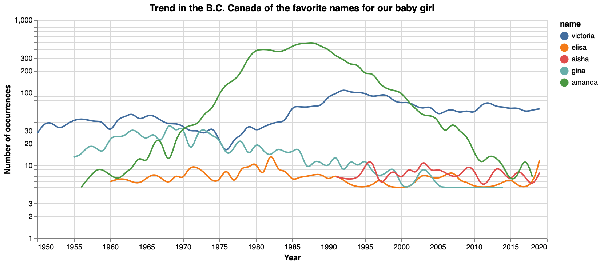

# Baby names

Analysis of popular baby names in English and Spanish from public databases from the USA, Canada and Spain.

_Elisa on the keyboard. Image by Victor Cuspinera._

## Intro

Getting a name for a baby is not as trivial as people could think, or at least not for my wife and me. 

When we were expecting our first baby girl, during the last five months of the pregnancy, we looked for options of names on different sources as websites and books with popular baby names, websites with international names, asked recommendations between our friends, or even wrote down names of movies and tv series characters.

After months of searching names, on early April of 2021 we came with a list of our favorite names for the baby girl:

|Mom's choices| Dad's choices|
|:------------|:-------------|
|Elisa        |Aisha         |
|Macarena     |Amanda        |
|             |Carlina       |
|             |Gina          |
|             |Victoria      |

However, we didn't agree in a name for the baby. So, I started to wonder how we could make the best selection of the name for our baby? Which are the most popular names? Is there a way to measure how well a surname sounds combined with the family name?

## Databases

The first step was to look for names. In our case, because we live in Mexico we were interested on names in Spanish; however, we also were open for a name from an English-speaking country. 

### Names in Spanish

I was interested in looking for a database of names in __Mexico__ 🇲🇽. I found that the _Registro Nacional de Población_ (National Population Registry) has this information, but it is not public available. 

However, I found that _Instituto Nacional de Estadística_ (Statistics National Institute) from __Spain__ 🇪🇸 has open data of the most popular 100 names in this country from 2002 to 2019, and also data of names with frequency equal to or greater than 20 people in 2019.

### Names in English

For names from English speaking countries, I found two databases of popular baby names: one from __the U.S.__ 🇺🇸 published by the [Social Security Agency](https://www.ssa.gov/oact/babynames/), and another from British Columbia, __Canada__ 🇨🇦, shared by the [Government of B.C.](https://www2.gov.bc.ca/gov/content/life-events/statistics-reports/bc-s-most-popular-baby-names)

## Merge databases

While three of the four databases contain similar information, they have different formats. For example, the databases with names from Spain have one Excel file for each year, while Canadian data is divided in male and female files, and finally the information from the U.S. have one text file for each year since 1880 until 2019.

To make life easier, in the [merge_clean.ipynb](https://github.com/vcuspinera/Baby_names/blob/main/src/merge_clean.ipynb) notebook from this Repository, I merge the different files for each database and unify the format by using the next four columns: `name`, `year`, `sex` and `number`, and save these files. 

## EDA

When comparing the databases of popular names from Spain, the U.S. and Canada, it would be observed that the number of distinct names were very different among databases. These differences probably could be explained by the structure of the databases because the range of years and their characteristics:

|Country| Number of different names| Number of years| Years | Charactersitics of database|
|:---|:---:|:---:|:---:|:---|
|Spain| 379| 18| 2002-2019| Most popular 100 names |
|B.C., Canada| 4,340| 100| 1920-2019|Names with 5 or more observations |
|USA| 99,444| 140| 1880-2019|Names with 5 or more observations |

While the growth in the average number of people per name is stable for the USA and Canada around 0% level, it is not for Spain, probably because it contains only the 100 most popular names in Spain, compared with the extensive list of names in the USA and Canada data.

[⭐️ click here](https://github.com/vcuspinera/Baby_names/blob/main/src/analysis.ipynb) to see the notebook with the complete EDA and main analysis.

## Descriptive analysis of our favorite names 

This section I would present the main finds of the descriptive analysis of the perform of our favourite names: Aisha, Amanda, Carlina, Elisa, Gina, Macarena and Victoria, in the names databases from Spain, the U.S. and Canada.

### Spain 🇪🇸

Between the favorite names of our baby, while using the Spain database, the most used name is **victoria** with 59.6 thousand females, followed by **elisa** with 36.3 thousand people, **macarena** with 14.4 thousand, **amanda** with 12.9 thousand, **gina** with 2.3 thousand, **aisha** with 2.0 thousand, and **carlina** with 147 people.

In the other hand, the youngest name is **aisha** with an average age of 9.9 years old, followed by **gina** with an average of 21.4 years old, **amanda** with 24.8 years old, **macarena** with 29.9 years old, **victoria** with 46.7 years old, **elisa** with 48.7 years old, and **carlina** with 61.2 years old.

Until now we haven't talk much about the second source from the _Instituto Nacional de Estadística_ from Spain that contain the data of names with frequency equal to or greater than 20 people in 2019. The beauty of this source is that it contains the complete list of names considering also compound names, which was helpful to identify the most common compound names associated with the list of our favorite names, and its average age. For example, the name __maria victoria__ contains the name __victoria__ and it is the most popular name that contain one of our favorite options for our baby girl, however, its average age was 53 years old which means it is a name for older people.

In this sense, in the databases we could find 243 compound names that includes __victoria__, 82 with __elisa__, 31 with __macarena__, 28 with __amanda__, 10 with __gina__, and 3 with __aisha__ and 2 with __carlina__.

The next plot shows the comparison between frequency and average age for all single and compound names that contain one of our seven favorite names for our baby girl.

Finally, the following word cloud presents the compound names with frequency equal to 75 or more observations. While the nodes represent each name, the arrows show the order of connection between names and the darker the arrow, the stronger is the connection between names. For example, the names **maria** and **victoria** are connected in both ways and forms the compound names **maria victoria** and **victoria maria**.

### USA 🇺🇸

For the U.S. plot, I am presenting the trend of newborn babies per year from 1950 to 2019 that had any of our seven favorite names.

Here we find that while **victoria** has been popular for all years, **gina** became the most popular name in the late 60's and **amanda** in the 80's. The name **elisa** has been in the middle range of our favorite names with values around 500 observations per year, while **aisha** popularity increased from around 10 observations on the 60's to 1,000 on the 70's and became steady on that level. Finally, the names **carlina** and **macarena** are the least popular from our list in records from the U.S.

### BC, Canada 🇨🇦

In this case the following plot presents the trend of newborn babies per year from 1950 to 2019 in British Columbia, Canada, that had any of our favorite names. In this case, the database has information of five from our seven selected names: __victoria__, __elisa__, __amanda__, __gina__ and __aisha__.

Similar to the plot from the U.S., here we find that **victoria** has been popular for all years and **amanda** became the most popular name in the 80's and 90's. The popularity of **gina** decreased over time. And finally, the names **elisa** and **aisha** have low records.

## Scoring names using [International Phonetic Alphabet (IPA)](https://en.wikipedia.org/wiki/International_Phonetic_Alphabet)

The last effort of this analysis is to construct a tool that measures how well a surname combines with anothers surname and/or family names.

For this purpose, I transform the names to their Spanish and English phonetic notation using the [IPA](https://en.wikipedia.org/wiki/International_Phonetic_Alphabet), and look for ryhmes in English and Spanish for each comparison between each two strings (names). For example, in the name **maria victoria smith** this function gets the score for the comparison between (1) **maria** and **victoria**, (2) **maria** and **smith**, and (3) **victoria** with **smith**.

In each of this two-strings comparison, I get three scores: Spanish, English and Total. Finally, for complete names with more than two strings I average all scores for Spanish, all scores for English, and all Total scores getting also three final scores (Spanish, English and Total) for a complete name.

[⭐️ click here](https://github.com/vcuspinera/Baby_names/blob/main/src/Names_rhyme.py) to look into the class used to get scores of rhymes of names.  

😅 **_Fun fact:_** when I finally arrived to this point of the analysis on mid-April 2021, my wife already choose a name for our baby girl: **elisa**. From this point, it was on my side to choose if I wanted a compound name for the baby.  

| Name| IPA Spanish| IPA English| Score Spanish| Score English| Score Total|
|:---|:---|:---|:---:|:---:|:---:|
| elisa cuspinera martinez| elisa kuspineɾa maɾtines| əˈlizə kʊzpɪˈnirə mɑrˈtinɛz| 0.0556| 0.3334| 0.1944|

Among the compound female names that includes **elisa** combined with our family names **cuspinera** and **martinez** (this is because in Mexico and Latin America we use two family names), the top of possible second names with higher scores were: aisa, akira, alisa, ariza, corisa, delisa, elfrida, elissa, elvina, elyria, elysia, erisa, isa, jazeera, lisa, liza, louisa, luisa, **macarena**, maeda, magdalena, makita, malina, malinda, malvina, marcelia, marcellina, marchita, margarita, marilda, marina, marquita, martina, martita, mathea, matthea, maurita, mayeda, miera, misa, raisa, riera, risa, shakira, viera.

As you could realize, one of these names is **macarena**. So, as in the movie _Inception_, I felt that my wife implanted on my head the idea of this name and, among the top options of compound names combined with **elisa**, this one was my favorite mainly becase the way it sounds when combining **macarena** and **cuspinera**. Actually, **macarena cuspinera** scores 0.5 in Spanish and 0.6667 in English.  

Finally, we decide that the name of our baby girl would be **elisa macarena cuspinera martinez**, which has an even better score than elisa cuspinera martinez.

| Name| IPA Spanish| IPA English| Score Spanish| Score English| Score Total|
|:---|:---|:---|:---:|:---:|:---:|
| elisa macarena cuspinera martinez| elisa makaɾena kuspineɾa maɾtines| əˈlizə mækəˈrinə kʊzpɪˈnirə mɑrˈtinɛz| 0.1667| 0.4167| 0.2917|

## Final comments

Choosing the name of your baby could be not as easy as people think. The aim of this project was to build a tool that measures how well a complete name would sound assigning a score to make it easier finding possible names for a baby. However, as a tool, this model is only a piece of the puzzle and this could (and should) be complemented with other qualitative variables, for example, meaning of names, regional customs, family traditions, trends and/or other ideas from the future parents.

## Dependencies

|Python packages|Python packages|
|:--------------|:--------------|
|altair         |eng_to_ipa     |
|epitran        |numpy          |
|pandas         |re             |
|rpy2           |time           |
|word_tokenize  |               |

## Project Organization    

    ├── README.md                <- The top-level README
    ├── data
    │   ├── names                <- Files that merges raw data, and the results with scores from the 
    │   │                           customed Class named ad Names_rhyme.py
    │   └── raw                  <- Contains the raw data of the names from Spain, the US and Canada
    │
    ├── src                      <- Source code for use in this project
    │   ├── merge_clean.ipynb    <- Merge the raw databases
    │   ├── analysis.ipynb       <- Performs the EDA and main analysis
    │   ├── Names_rhyme.py       <- Class that returns the scores (Total, Spanish and English)
    │   └── Cuspinera-Martinez_baby.ipynb   <- Example of using the customed class Names_rhyme.py
    │                                          with the name of our baby    
    │
    └── img                      <- Images for the main README file

## References
- __Popular names in Spain__
    - [Most frequent first names and surnames](https://www.ine.es/dyngs/INEbase/es/operacion.htm?c=Estadistica_C&cid=1254736177009&menu=resultados&idp=1254734710990#!tabs-1254736195454) by Instituto Nacional de Estadística.  
    
- __Popular names in the USA__
    - [Popular Baby Names](https://www.ssa.gov/oact/babynames/limits.html) by the Social Security Agency.  
    - [Social Security Agency](https://www.ssa.gov/oact/babynames/) official webpage.  
    - [US Baby Names dashboard](https://www.dashboardom.com/us-baby-names) by Elias Dabbas.  

- __Popular names in British Columbia, Canada__
    - [B.C.'s Most Popular Baby Names](https://www2.gov.bc.ca/gov/content/life-events/statistics-reports/bc-s-most-popular-baby-names) by the Government of British Columbia.  
    
- __Tools__
    - David Mortensen. (2021). [`epitran`](https://pypi.org/project/epitran/) Python library.  
    - ICHI PRO. (2020). [Analyzing Poetry with Python](https://ichi.pro/es/analizando-la-poesia-en-python-137202249551277). *Original article in Spanish*.  
    - Julia Silge and David Robinson. (2017). [Text Mining with R: A Tidy Approach](https://www.tidytextmining.com/ngrams.html). Chapter 4 Relationships between words: n-grams and correlations.  
    - mphilli, Mitchellpkt, CanadianCommander, timvancann. (2020). English to IPA [`eng-to-ipa`](https://pypi.org/project/eng-to-ipa/) Python library.  
    - toPhonetics. [Online converter of English text to IPA phonetic transcription](https://tophonetics.com).  
