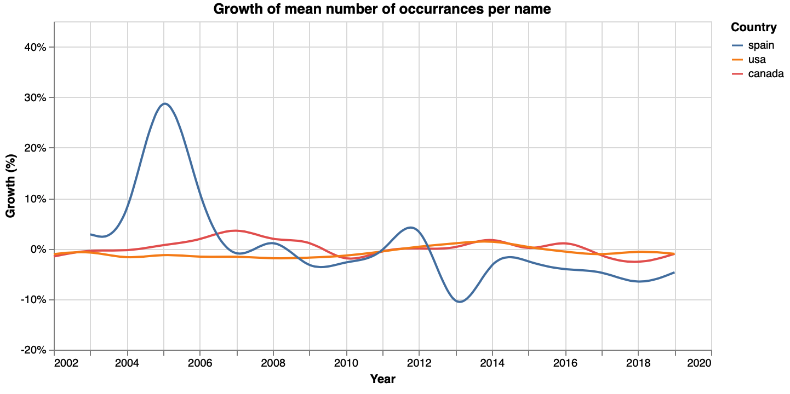
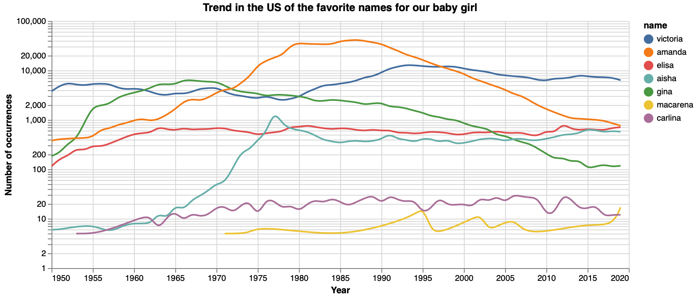

```{r setup, include=FALSE}
knitr::opts_chunk$set(echo = FALSE)
```

## Comentarios iniciales

⚠️ Presentation in Spanish  

⭐️ Preparada para el webinar de la [Maestría en Ciencia de los Datos](http://mcd.cucea.udg.mx) de La Universidad de Guadalajara


## Sobre el autor
__Nombre__: Victor Cuspinera  

__Formación__: Licenciatura en Actuaría (2007), y Maestrías en Economía (2014) y Ciencia de Datos (2020)  

__Experiencia__: Analista e investigador en el Banco de México, en el área de dinero en efectivo  

__¿Por qué hacer proyectos?__ Para crear un portafolio de proyectos, ejercitar mis habilidades como _Data Scientist_, y seguir aprendiendo herramientas nuevas

# 1ra parte. El proyecto

Baby Names Baby Names Baby Names Baby Names 
Baby Names Baby Names Baby Names Baby Names 
Baby Names Baby Names Baby Names Baby Names 
Baby Names Baby Names Baby Names Baby Names 
Baby Names Baby Names Baby Names Baby Names 
Baby Names Baby Names Baby Names Baby Names 
Baby Names Baby Names Baby Names Baby Names 
Baby Names Baby Names Baby Names Baby Names 
Baby Names Baby Names Baby Names Baby Names 
Baby Names Baby Names Baby Names Baby Names 
Baby Names Baby Names Baby Names Baby Names 
Baby Names Baby Names Baby Names Baby Names 
Baby Names Baby Names Baby Names Baby Names  

### Choosing a baby name using Python  


## Intro

### __Motivación__

Seleccionar el nombre de un bebé puede no ser un asunto trivial, o al menos no para mi esposa y para mí cuando supimos que íbamos a tener una bebé.  

Buscamos nombres para bebés en todos lados: en libros y páginas web de nombres populares, nombres internacionales, recomendaciones de amigos, nombres de personajes de series y películas.  

Para inicios de abril ya teníamos 7 nombres: los favoritos de mi esposa eran Elisa y Macarena, y los míos Aisha, Amanda, Carlina, Gina y Victoria.


## Intro

### __Dudas__
Sin embargo, empezaron a surgir varias preguntas:  

- ¿hay alguna mejor manera de elegir un nombre para nuestra bebé?  
- ¿cuáles son los nombres más populares?  
- ¿existen tendencias de nombres?  
- ¿hay algún nombre que suene mejor combinado con nuestros apellidos (Cuspinera Martínez)?  
- ¿esto aplica también para nombres en países donde se habla inglés?


## Bases de datos

### __Español__

__México 🇲🇽__  
- Registro Nacional de Población ❌  

__España 🇪🇸__  
- [Instituto Nacional de Estadística  ✅](https://www.ine.es/dyngs/INEbase/es/operacion.htm?c=Estadistica_C&cid=1254736177009&menu=resultados&idp=1254734710990#!tabs-1254736195454)

### __Inglés__

__U.S.A.  🇺🇸__    
-  [Social Security Agency ✅](https://www.ssa.gov/oact/babynames/)

__Canadá (provincia de British Columbia) 🇨🇦__  
-  [Government of B.C. ✅](https://www2.gov.bc.ca/gov/content/life-events/statistics-reports/bc-s-most-popular-baby-names)

## Bases de datos

Ejemplo de base de datos original (Canadá)

```{python, echo = FALSE}
# General libraries
import pandas as pd
import numpy as np
import re

# To plot
import altair as alt
# alt.renderers.enable('mimetype')
# alt.renderers.enable('default')

# translators to IPA
import epitran # call the epitran library
import eng_to_ipa as ipa # call the eng_to_ip library

# select another folder
import sys
sys.path.append('../src/')

# customed funtion 
from Names_rhyme import Names_rhyme
```

```{r load_packages, echo = FALSE}
library(vegawidget) # Need to install this using: install.packages('vegawidget')
library(reticulate)
```

```{python, echo = FALSE}
# Parameters
my_folder = "../data/raw/"

# Open files
df_raw = pd.read_csv('../data/raw/Canada/bc-popular-girls-names.csv')

df_raw
```


## Exploración de datos (EDA)

Aunque la información en las bases de datos es similar, al revisar con mayor detalle su estructura, temporalidad, formato y alcance son distintos: 

|País | No. de nombres distintos| Total de años| Periodo | Características de la BD| No. de archivos (formato)|
|:---|:---:|:---:|:---:|:---|:---|
|España$^1$| 379| 18| 2002-2019| 100 nombres más populares | 18 (XLS)|
|Canadá (B.C.)| 4,340| 100| 1920-2019|Nombres con 5 observaciones o más | 2 (CSV) |
|USA| 99,444| 140| 1880-2019|Nombres con 5 observaciones o más | 140 (TXT) |

<p style="font-family: times, serif; font-size:11pt; font-style:bold">
1: Para España también se identificó una base de datos de los [nombres con 20 observaciones o más en 2019](https://www.ine.es/dyngs/INEbase/es/operacion.htm?c=Estadistica_C&cid=1254736177009&menu=resultados&idp=1254734710990#!tabs-1254736195454), del INE.
</p>


## Exploración de datos (EDA)

- El crecimiento anual en el número de nombres en las bases de datos de USA y Canadá es estable alrededor de cero.  
- En la base de datos de España hay variaciones de hasta 30%, lo cual está relacionado con la estructura de la base de datos (sólo los 100 nombres más populares).




## Limpieza de datos

- Abrir 160 archivos en distintos formatos y estructura, los cuales contienen información con las bases de datos de España, USA y Canadá. 
- Estandarizar las columnas y consolidar la información en una única base de datos.  
- Convertir los nombres a minúsculas.  
- Revisar casos especiales (e.g. el nombre `Nan` equivalente a valores nulos).
- Conservar la información por país aunque algunos nombres se repitan en la base de datos.  

## Limpieza de datos

Base de datos consolidada.

```{python, echo = FALSE}
# Parameters
my_folder = "../data/names/"

# Open files
df_sp_avg_age = pd.read_csv(my_folder + 'names_spain_average_age.csv').drop(columns=['Unnamed: 0'])
df_sp = pd.read_csv(my_folder + 'names_spain.csv').drop(columns=['Unnamed: 0'])
df_us = pd.read_csv(my_folder + 'names_usa.csv').drop(columns=['Unnamed: 0'])
df_ca = pd.read_csv(my_folder + 'names_canada.csv').drop(columns=['Unnamed: 0'])

# Add country and language
df_sp_avg_age['country'] = 'spain'
df_sp['country'] = 'spain'
df_us['country'] = 'usa'
df_ca['country'] = 'canada'

# df_sp_avg_age['language'] = 'spanish'
df_sp['language'] = 'spanish'
df_us['language'] = 'english'
df_ca['language'] = 'english'

# Rename 'NaN' to 'nan'
df_us.loc[df_us[df_us.loc[:, 'name'].isnull()].index, 'name'] = 'nan'
df_sp_avg_age.loc[df_sp_avg_age[df_sp_avg_age.loc[:, 'name'].isnull()].index, 'name'] = 'nan'

# Merge data from Spain, USA and Canada in one total database
df_tot = pd.concat([df_sp, df_us, df_ca]).reset_index(drop=True)
df_tot
```

## Análisis descriptivo
El análisis del resto del documento está relacionado sólo con los nombres favoritos para nuestra bebé: __aisha, amanda, carlina, elisa, gina, macarena__ y __victoria__.  

⭐️ Para ver el análisis completo el cual contiene detalle sobre los nombres más populares y de género por país, revisar el [jupyter notebook `analysis.ipynb` del repositorio de _Baby Names_ en GitHub](https://github.com/vcuspinera/Baby_names/blob/main/src/analysis.ipynb).

## Análisis descriptivo: __España 🇪🇸__

De nuestros nombres favoritos en la base de datos de España, el nombre más popular es __victoria__ con 59.6 mil registros, seguido de __elisa__ con 36.3 mil, __macarena__ con 14.4 mil, __amanda__ con 12.9 mil, __gina__ con 2.3 mil, __aisha__ con 2 mil y __carlina__ con 147 registros.

Respecto a la edad promedio, mientras __aisha__ es el nombre para mujeres más jóvenes con 9.9 anõs promedio, en el otro extremo tenemos a __carlina__ con 61.2 años.

```{python, echo = FALSE, include=FALSE}
#List of our favorite names
our_baby = ['Macarena', 'Elisa', 'Victoria', 'Gina', 'Aisha', 'Amanda', 'Carlina']
our_baby = pd.DataFrame([i.lower() for i in our_baby]).rename(columns={0:"name"})

# Data base for plot
source = df_sp_avg_age[df_sp_avg_age.name.isin(our_baby.name.to_list())].sort_values(by='number', ascending=False)

# Frequency plot
bars = alt.Chart(source[:30]).mark_bar().encode(
    alt.X("number", title="Number of occurrences", scale=alt.Scale(type='log')),
    alt.Y("name:O", title="", sort=source.name.to_list()),
    alt.Color("name", legend=None, sort=source.name.to_list(), scale=alt.Scale(scheme='spectral')),
    tooltip = ['name', 'sex', 'number', 'average_age']
).properties(
    title='Frequency',
    width = 300
)

# Average age plot
bars2 = alt.Chart(source.sort_values(by='average_age')[:30]).mark_bar().encode(
    alt.X("average_age", title="Age"),
    alt.Y("name:O", title="", sort=source.sort_values(by='average_age').name.to_list()),
    alt.Color("name", legend=None, sort=source.sort_values(by='average_age').name.to_list(), scale=alt.Scale(scheme='plasma')),
    tooltip = ['name', 'sex', 'number', 'average_age']
).properties(
    title='Average age'
)

my_plot = (bars | bars2).resolve_scale(
        color='independent'
    ).to_json()
```

```{r}
as_vegaspec(py$my_plot)
```


## Análisis descriptivo: __España 🇪🇸__

Frecuencia vs. edad promedio de nombres compuestos en la base de datos de 2019 de España.

```{python, echo = FALSE}
# Plot of Frequency vs. Average age of our favorite names

# Chunck to look for the compound names of our favorite names for our baby girl
newlist = dict()
for name in our_baby.name:
    mylist = df_sp_avg_age[df_sp_avg_age.sex=='F'].name.apply(str)
    r = re.compile(('('+name+'\s+[A-Za-z]+)|([A-Za-z]+\s+'+name+'$)|(^'+name+'$)'))
    newlist[name] = sorted(list(filter(r.match, mylist)))

# our_baby data frame
my_list = (newlist['macarena'] + newlist['elisa'] + newlist['victoria'] + newlist['gina'] + 
           newlist['aisha'] + newlist['amanda'] + newlist['carlina'])
my_group = (len(newlist['macarena'])*['macarena'] + len(newlist['elisa'])*['elisa'] +
            len(newlist['victoria'])*['victoria'] + len(newlist['gina'])*['gina'] +
            len(newlist['aisha'])*['aisha'] + len(newlist['amanda'])*['amanda'] +
            len(newlist['carlina'])*['carlina']
           )
my_df = pd.concat([
    df_sp_avg_age[df_sp_avg_age.name.isin(newlist['macarena'])],
    df_sp_avg_age[df_sp_avg_age.name.isin(newlist['elisa'])],
    df_sp_avg_age[df_sp_avg_age.name.isin(newlist['victoria'])],
    df_sp_avg_age[df_sp_avg_age.name.isin(newlist['gina'])],
    df_sp_avg_age[df_sp_avg_age.name.isin(newlist['aisha'])],
    df_sp_avg_age[df_sp_avg_age.name.isin(newlist['amanda'])],
    df_sp_avg_age[df_sp_avg_age.name.isin(newlist['carlina'])],
]).reset_index(drop=True)

my_df['group'] = my_group

# plot
my_plot2 = alt.Chart(my_df).mark_circle(opacity=0.6).encode(
    alt.X('average_age', title='Average Age'),
    alt.Y('number', title='Frequency', scale=alt.Scale(type='log')),
    alt.Color('group', title='Name', sort=our_baby.name.to_list()),
    alt.Size('number:O', legend=None),
    tooltip=['name', 'sex', 'number', 'average_age']
).properties(
    title="Frequency vs. Average Age, by variants of each base name",
    width=650, height=320
).to_json()
```

```{r}
as_vegaspec(py$my_plot2)
```

## Análisis descriptivo: __España 🇪🇸__

```{r out.width='55%', out.extra='style="float:right; padding:20px"'}
knitr::include_graphics("../img/img_5_wordcloud.png")
```

_Word cloud_ de nombres compuestos con 75 observaciones o más.  

Los nodos representan los nombres, las flechas el orden y entre más obscuras las flechas más fuerte la conexión entre ambos nombres. 


## Análisis descriptivo: __USA 🇺🇸__

Gráfica de tendencias de nombres de 1950 a 2019, en USA. Se observa que __victoria__ ha sido popular a lo largo del tiempo, mientras que __amanda__ aumentó su popularidad entre los años 80's y 90's. Por otro lado, __carlina__ y __macarena__ tienen pocas observaciones.




## Análisis descriptivo: __Canadá 🇨🇦__

Gráfica de tendencias de nombres de 1950 a 2019, en British Columbia, Canadá. Esta base de datos contiene información a nivel local, no nacional, por lo que no aparecen todos nuestros nombres favoritos (faltan __macarena__ y __carlina__). Al igual que en USA, el nombre __victoria__ ha sido popular a lo largo del tiempo, y __amanda__ entre los años 80's y 90's.


## Scores de nombres usando el IPA (Alfabeto Fonético Internacional)

El último punto de este proyecto fue crear un _scoring_ para identificar qué tan bien combinan los nombres con nuestros apellidos.

Se utilizaron diccionarios de Python para traducir los nombres al [Alfabeto Fonético Internacional (IPA)](https://en.wikipedia.org/wiki/International_Phonetic_Alphabet) tanto en español como inglés.

Ejemplo:
```{python, echo = FALSE}
# nombre
nom = "Victoria"

# Español
epi = epitran.Epitran('spa-Latn') # select an ISO 639-3 code
nom_spa = epi.transliterate(nom) # transform a text from to IPA

# English
nom_eng = ipa.convert(nom) # transform a text from English to IPA

# Imprime el dataframe del ejemplo
pd.DataFrame([nom, nom_spa, nom_eng], index=['Texto original', 'IPA español', 'IPA inglés'], columns=['Nombre'])

```

## Scores de nombres usando el IPA

Para obtener las métricas se identifican las rimas en ambos idiomas comparando uno a uno cada nombre con los otros nombres y apellidos.

En esta comparación, se identifica la rima asonante de la última vocal, rima asonante de las dos últimas vocales, rima consonante de la última sílaba, coincidencia de nombres en la primera sílaba, asiganando 1 en caso de coincidencia y 0 en caso contrario. Con estos resultados, y de forma ponderada, se obtiene un puntaje en español, otro en inglés y el puntaje total obtenido del promedio de los dos anteriores.

Ejemplo de fórmula para obtener el puntaje en español.

$$\tiny Score\ Spanish = \frac{\sum{(last\_vowel_{SPA},\ 2 \times last\_2\_vowels_{SPA},\ 2 \times last\_syllable_{SPA},\ initial\_letters_{SPA})}}{6}$$

## Scores de nombres usando el IPA

Puntuación para nuestros nombres favoritos:

```{python, echo = FALSE}
# getting the scores for our favorite names combined 
score_names = ['Spanish', 'English', 'Total score']
fav_names = ['aisha', 'amanda', 'carlina', 'elisa', 'gina', 'macarena', 'victoria']

my_score = {}
for i in fav_names:
    v = Names_rhyme()
    score = v.check_complete_name(i + " cuspinera martinez")
    my_score[i + " cuspinera martinez"] = score

# scores
pd.DataFrame(my_score, index=score_names).transpose()
```

__macarena__ es el nombre con mayor puntaje de entre nuestros nombres favoritos, seguidos por __elisa, gina__ y __victoria__.

## Scores de nombres usando el IPA

⚠️ Cuando llegué a este punto, a mediados de abril 2021, mi esposa ya había elegido el primer nombre de nuestra bebé: __elisa__.  Ahora estaba en mis manos el decidir si nuestra bebé tendría un único nombre o un nombre compuesto.  

Al combinar todos los nombres de la base de datos consolidada con el nombre __elisa__ y nuestros apellidos __cuspinera martinez__, los nombres con mayor puntaje fueron: aisa, akira, alisa, ariza, corisa, delisa, elfrida, elissa, elvina, elyria, elysia, erisa, isa, jazeera, lisa, liza, louisa, luisa, __macarena__, maeda, magdalena, makita, malina, malinda, malvina, marcelia, marcellina, marchita, margarita, marilda, marina, marquita, martina, martita, mathea, matthea, maurita, mayeda, miera, misa, raisa, riera, risa, shakira, viera.

## Scores de nombres usando el IPA

El nombre de __macarena__ se encuentra también entre los nombres compuestos que, combinados con __elisa__, tienen mayor puntaje.

```{python, echo = FALSE}
# getting the scores for our favorite names combined 
fav_names = ['elisa macarena']

my_score = {}
for i in fav_names:
    v = Names_rhyme()
    score = v.check_complete_name(i + " cuspinera martinez")
    my_score[i + " cuspinera martinez"] = score

# scores
pd.DataFrame(my_score, index=score_names).transpose()
```


Finalmente, decidimos que el nombre de nuestra bebé sería __elisa macarena cuspinera martinez__.  

## Comentarios finales del proyecto

Escoger un nombre para un bebé puede no ser tan sencillo. Durante este proyecto, en el proceso de selección se desarrolló una herramienta que mide como suena un nombre completo asignando una puntuación para hacer más fácil la comparación entre los posibles nombres para un bebé. Esta herramienta es una propuesta inicial y tiene limitaciones, por lo que podría mejorarse considerando otros factores fonéticos (ritmo, acentuación, secuencia de nombres, entre otros), cambiando las ponderaciones en la función para obtener el _scoring_, o considerando otros idiomas.  

Como una herramienta, este modelo es sólo una parte del rompecabezas que podría (y debería) ser complementado con otras variables cualitativas como el significado de los nombres, tradiciones regionales y/o familiares, tendencias, u otras ideas de los futuros padres, durante la selección del nombre del bebé.

## Dónde encontrar este proyecto

```{r, echo=FALSE}
# Define variable containing url
url_linkedin <- "https://upload.wikimedia.org/wikipedia/commons/c/ca/LinkedIn_logo_initials.png"
url_github <- "https://upload.wikimedia.org/wikipedia/commons/4/4a/GitHub_Mark.png"
url_tds <- "https://pbs.twimg.com/profile_images/1261315088478343169/PKP-HJDv_400x400.jpg"
```

Este proyecto se ha buscado compartir a través de distintos espacios:

1. [Página personal 👤](https://vcuspinera.github.io/projects/2021/baby-names)  

2. [GitHub ](https://github.com/vcuspinera/Baby_names)  

3. [LinkedIn ](https://www.linkedin.com/pulse/choosing-baby-name-using-python-victor-cuspinera/)  

4. [Towards DataScience ](https://towardsdatascience.com/choosing-a-baby-name-using-python-5c842f1e1a2f)  
_(revista electrónica especializada)_

# 2da Parte. Comentarios y recomendaciones


## Recomendaciones
<style>
  .col2 {
    columns: 2 100px;         /* number of columns and width in pixels*/
    -webkit-columns: 2 100px; /* chrome, safari */
    -moz-columns: 2 100px;    /* firefox */
  }
</style>

__Lenguajes__
<div class="col2">
__...programación__  
- Python  
- R language

__...lengua__  
- Inglés (recomendado)  
</div>

__Herramientas:__  
- Entornos: Jupyter lab/notebook, RStudio  
- Control de versiones: Git y GitHub  
- Visualización: Matplotlib, Altair, ggplot2, Shiny, Tableau  
- Bases de datos: SQL, MongoDB  
- Servicios en la nube: AWS, Google

__Otras habilidades:__  
<div class="col2">
- Data Wrangling  
- Webscraping  
- Trabajo colaborativo  
- Reproducibilidad  
- NLP (análisis de texto)  
- Pronósticos (análisis temporal)  
- Análisis espacial  
</div>


## Ideas para proyectos personales

__¿Qué te interesa, gusta, o apasiona?__

<br>  

Favor de contestar la encuesta

Entra a [www.menti.com](https://www.menti.com)

Ingresa el código __6230 9621__  

Escribe tus ideas

<br>  


## Ideas para proyectos personales

Algunas de las ideas compartidas:

<div class="col2">
- Logística en transporte  
- Tráfico aéreo  
- Desempeño de equipos de futbol mexicano  
- Selección de posgrado  
- Fluctuación de criptomonedas  
- Análisis de precios y ofertas  
- Compra de inmuebles  
- Portadas de películas  
- Análisis de población  
- Experiencia de usuario  
- _Google lens_ para personas con discapacidad  
- Gestión de tiempo en redes sociales  
- Análisis espacial en salud pública

</div>
<br>
Muchas gracias por sus respuestas, el compendio completo de ideas se encuentra en [este link](https://github.com/vcuspinera/Baby_names/blob/main/img/MCD_UDG_ideas_proyectos.pdf).  

## Otros proyectos personales interesantes
- [Generador de Pokemmones](https://andrespitta.github.io/Pokemon-generator/) por Andres Pitta
- [Observación de ardillas en NYC Central Park](https://squirrel-park-cgostic.herokuapp.com) por Cari Gostlic  
- [Análisis de sentimiento de elecciones en Canadá](https://github.com/SamEdwardes/sentiment-cdn-election) por Sam Edwardes
- [Análisis de Sentimiento de respuesta de Canadá a Covid-19](https://www.linkedin.com/pulse/canada-response-covid-19-victor-cuspinera/) por Leopoldo y Victor Cuspinera


##  Desarrolla tu portafolio de proyectos
### __Proyectos personales__  
su inspiración puede venir de hobbies, deportes, música, familia, pláticas, experiencia laboral o académica

_Ventaja:_  
administrar su propio tiempo, desarrollar proyectos de su completo interés

_Desventaja:_  
promover su proyecto por ustedes mismos

##  Desarrolla tu portafolio de proyectos
### __Voluntariado__  
participar en voluntariados de ciencia de datos con [Omdena](https://omdena.com), [United Nations Volunteers](https://app.unv.org/?type=online), [Data Science for Social Good](https://www.solveforgood.org), entre otras instituciones

_Ventaja:_  
existen múltiples opciones de proyectos, aprender nuevas herramientas y habilidades, ampliar su red de contactos

_Desventaja:_  
consume mucho tiempo (15-20 hr por semana, de 4 a 8 semanas), no ingreso monetario

##  Desarrolla tu portafolio de proyectos
### __Hackathones y competencias__  
otra manera de aprender y desarrollar un portafolio es participando en competencias y hackathones, entre los más famosos están los de [Kaggle](https://www.kaggle.com/competitions) y [Driven Data](https://www.drivendata.org/competitions/). Algunas empresas lanzan hackathones para encontrar talentos, [Grupo Modelo lanzó el Breweing Data Cup](https://www.facebook.com/brewingdatacup/)

_Ventaja:_  
aprender mucho en corto tiempo  

_Desventaja:_  
los hackathones pueden ser maratónicos y desgastantes

# ¿Preguntas o comentarios?
